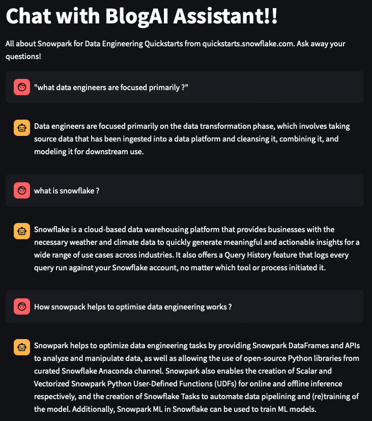

# 💬 BlogAI Assistant – Snowpark Q&A Chatbot

Welcome to **BlogAI Assistant**, an AI-powered chatbot that helps users explore and understand **Snowpark for Data Engineering** using natural language. It integrates **Azure OpenAI**, **HuggingFace Embeddings**, and **LlamaIndex** to deliver accurate answers with context-aware intelligence.

 <!-- Replace with actual screenshot path -->

---

## 🧠 Key Features

- 🔍 **Natural Language Q&A** for Snowflake, Snowpark, and Data Engineering concepts  
- 🤖 **Azure OpenAI Integration** for intelligent response generation  
- 📚 **Contextual Embeddings** via `BAAI/bge-small-en-v1.5` (HuggingFace)  
- 💬 **Interactive Chat Interface** (CLI or Web UI like Streamlit)  
- 📊 Query logging with history support

---

## 🛠️ Tech Stack

| Layer            | Tech                                |
|------------------|--------------------------------------|
| LLM Engine       | Azure OpenAI (`gpt-3.5` or `gpt-4`)  |
| Embedding Model  | HuggingFace `BAAI/bge-small-en-v1.5` |
| Framework        | LlamaIndex / Langchain               |
| Language         | Python 3.8+                          |
| Deployment       | Local / Cloud / Streamlit / Gradio   |

---

